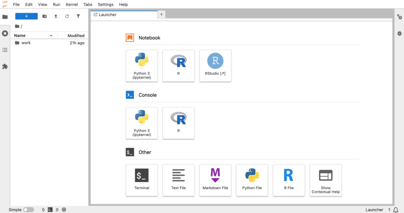

# jp_binder_arm64

<div align="right">
<a href="https://mana.bi/">鶴見教育工学研究所</a><br/>
田中 健太
</div>

mybinder.orgでも実行できます。

[](https://mybinder.org/v2/gh/tetlabo/jp_binder_arm64/HEAD){:target="_blank"}

[rocker/binder](https://github.com/rocker-org/binder) を参考に、日本語設定を追加しました。Jupyter Lab (ポート8888) とRStudio Serverがインストールされています。RStudio ServerにはJupyter Labのメニューからアクセスできます。また、[Jupyter for Java](https://github.com/jupyter-java)を導入し、Javaも実行できるようになっています。テキストマイニングのためのMeCabもインストールしています。

`rstudio` ユーザーにsudoers権限を付与しているので、`apt` でパッケージの追加なども可能です。mybinder.orgではroot / sudoers権限は付与されません。

<div align="center">

</div>

Apple Silicon (arm64) 向けにビルドしたイメージをDocker Hubに公開しています。以下のコマンドで使用できます。

```
docker pull manabi/jp_binder_arm64
```

ベースにしたrockerリポジトリのライセンスがGPL2なので、本リポジトリもそれに準じます。
