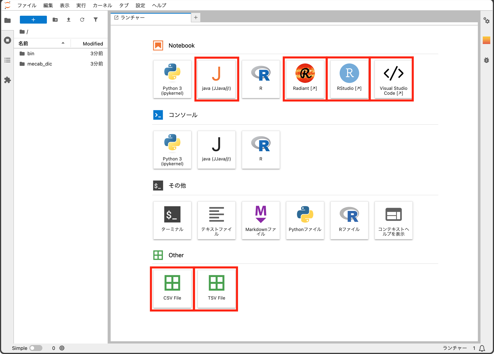

# jp_binder_arm64

<div align="right">
<a href="https://mana.bi/">鶴見教育工学研究所</a><br/>
田中 健太
</div>

mybinder.orgでも実行できます。

[](https://mybinder.org/v2/gh/tetlabo/jp_binder_arm64/HEAD)

<div align="center">

</div>

[rocker/binder](https://github.com/rocker-org/binder) を参考に、日本語設定を追加しました。Jupyter Lab (ポート8888) とRStudio Serverがインストールされています。RStudio ServerにはJupyter Labのメニューからアクセスできます。また、以下の機能追加を行いました。

* [Jupyter for Java](https://github.com/jupyter-java)
* [code-server: VS Code in the browser](https://github.com/coder/code-server)
    * Japanese Language Pack拡張
    * Python拡張
    * R拡張
    * languageserverパッケージ (R)
* [Radiant – Business analytics using R and Shiny](https://radiant-rstats.github.io/docs/)
* [jupyterlab-spreadsheet-editor](https://github.com/jupyterlab-contrib/jupyterlab-spreadsheet-editor)
* [Visual Python](https://visualpython.ai/)
* テキストマイニングのためのツール
    * [MeCab](https://taku910.github.io/mecab/) 
    * [Wikipedia見出し語辞書](https://github.com/tokuhirom/jawiki-kana-kanji-dict)
    * RMeCabパッケージ
    * gibasaパッケージ
* 各種のPythonパッケージ (バージョン指定はしていません)
    * numpy
    * pandas
    * matplotlib
    * seaborn
    * scipy
    * scikit-learn
    * plotly
    * imbalanced-learn
    * category-encoders
    * pycgettb
    * japanize-matplotlib
    * jaconv
    * openpyxl
* 日本語フォント
    * Noto Sans CJK JP
    * [UDEV Gothic](https://github.com/yuru7/udev-gothic) (RStudio Serverでも利用可能)

`rstudio` ユーザーにsudoers権限を付与しているので、`apt` でパッケージの追加なども可能です。mybinder.orgではroot / sudoers権限は付与されません。

Apple Silicon (arm64) 向けにビルドしたイメージをDocker Hubに公開しています。以下のコマンドで使用できます。

```
docker pull manabi/jp_binder_arm64
```

ベースにしたrockerリポジトリのライセンスがGPL2なので、本リポジトリもそれに準じます。
